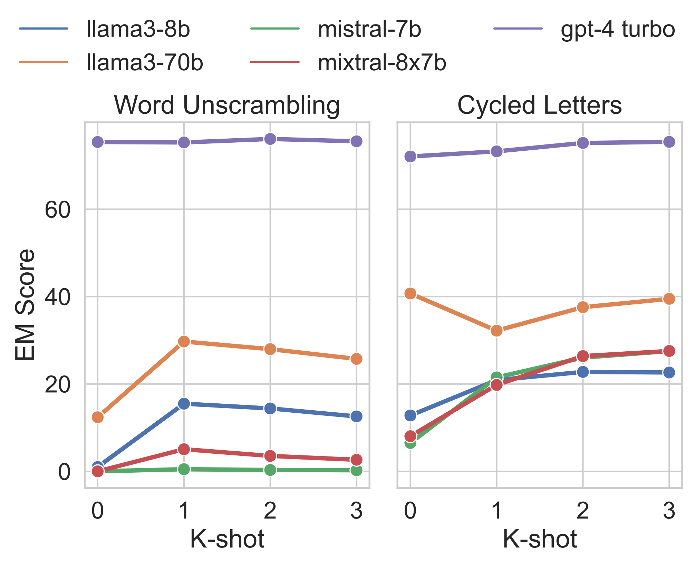
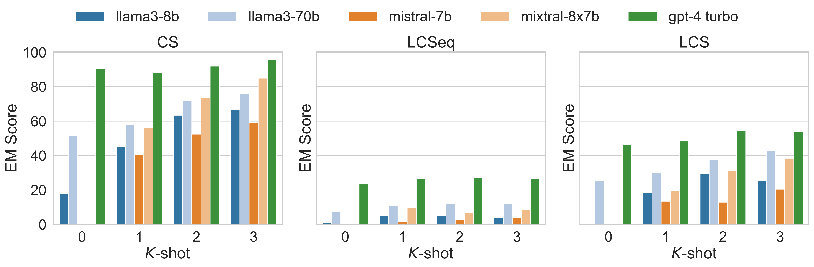
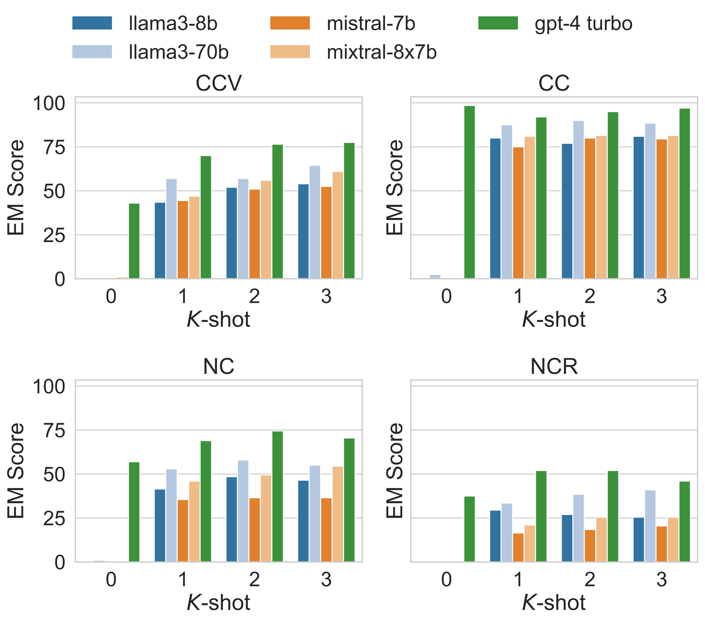

# [EMNLP'24 Findings | Tokenization Falling Short: On Subword Robustness in Large Language Models](https://aclanthology.org/2024.findings-emnlp.86/)

   <a href="https://huggingface.co/datasets/floatai/TKEval" target="_blank">
      
   </a> 
   <a href="https://arxiv.org/abs/2406.11687" target="_blank"></a>
  <a href="https://2024.emnlp.org/" target="_blank">  </a>


The official repository which contains the code and model checkpoints for our paper [Tokenization Falling Short: On Subword Robustness in Large Language Models (Findings of EMNLP 2024)](https://aclanthology.org/2024.findings-emnlp.86.pdf).


## 🔥 News
* **11 December, 2024:** 🚀 We release [TKEval dataset](https://huggingface.co/datasets/floatai/TKEval) and evalution code.
* **21 September, 2024:** 🎉 Our work has been accepted to [EMNLP 2024 (Findings)](https://2024.emnlp.org/)! ⭐

## Contents
- [Data Preparation](#data-preparation)
- [Evaluation](#evaluation)
  - [Complex Problem Solving](#1-complex-problem-solving)
  - [Token Structure Probing](#2-token-structure-probing)
  - [Typographical Variation](#3-typographical-variation)
    - [char-level](#31-character-level-typographical-variation)
    - [token-level](#32-token-level-typographical-variation)

## Data Preparation
  ```shell
  download_dir=./data/TKEval
  mkdir ${download_dir}
  cd ${download_dir}
  git lfs install
  git clone https://huggingface.co/datasets/floatai/TKEval
  cd -

  # replace archive.tar address in mmlu_no_train.py
  bash scripts/process_mmlu.sh ${download_dir}
  ```

## Evaluation
### 1. Complex Problem Solving
  ```shell
  # evaluate and dump generation results to output/
  mkdir output/
  ## cycled letters in word
  python -u src/eval_rq1.py \
    --model_path /mnt/data/models/Meta-Llama-3-8B \
    --data_path ${download_dir}/complex_problem_solving/cycled_letters_all_data_0123_shots.json \
    --eval_metric generation \
    --output_path output/cycled_letters.llama3-8b.json \
    --batch_size 64
  ## word unscrambling
  python -u src/eval_rq1.py \
    --model_path /mnt/data/models/Meta-Llama-3-8B \
    --data_path ${download_dir}/complex_problem_solving/word_unscrambling_all_data_0123_shots.json \
    --eval_metric generation \
    --output_path output/word_unscrambling.llama3-8b.json \
    --batch_size 64
  ## identify math theorems
  python -u src/eval_rq1.py \
    --model_path /mnt/data/models/Meta-Llama-3-8B \
    --data_path ${download_dir}/complex_problem_solving/identify_math_theorems_all_data_0123_shots.json \
    --eval_metric multiple_choice \
    --output_path output/identify_math_theorems.llama3-8b.json \
    --batch_size 64
  ```
#### Results
<div align = "center">

<br>
</div>

### 2. Token Structure Probing
  ```shell
  # task value options: 
  # "multi_token_prob.common_substrings", 
  # "multi_token_prob.longest_common_subsequences", 
  # "multi_token_prob.longest_common_substrings", 
  # "token_struct_prob.char_case_conversion", 
  # "token_struct_prob.character_count",
  # "token_struct_prob.nth_character",
  # "token_struct_prob.nth_character_from_end"

  task="multi_token_prob.common_substrings"
  python -u src/eval_rq1.py \
      --model_path /mnt/data/models/Meta-Llama-3-8B \
      --data_path ${download_dir}/token_structure_probing/test/${task}.all_data_0123_shots.json \
      --eval_metric generation \
      --output_path output/${task}.llama3-8b.json \
      --batch_size 64
  ```
#### Results
<div align = "center">
<!--  -->

<br>
</div>

### 3. Typographical Variation
#### 3.1. Character-level typographical variation

For **[MMLU](https://huggingface.co/datasets/cais/mmlu), [GSM8K](https://huggingface.co/datasets/openai/gsm8k), [TruthfulQA](https://huggingface.co/datasets/truthfulqa/truthful_qa)**, we utilize [lm-evaluation-harness](https://github.com/EleutherAI/lm-evaluation-harness) for evaluation.
##### Step1: Setup
``` shell
git clone https://github.com/EleutherAI/lm-evaluation-harness.git
cd lm-evaluation-harness
pip install -e .
```

##### Step2: Replace data-path with TKEval
```shell
download_dir="./data/"
ngram=3 # [2, 3, 5]
scramble_type="typo.char.permute" # ["typo.char.permute", "typo.char.noise"]
## for gsm8k
sed -i 's#dataset_path.*#dataset_path: '${download_dir}'/data.'${scramble_type}'/ngram_'${ngram}'/gsm8k#g' lm_eval/tasks/gsm8k/gsm8k.yaml

# ## for mmlu
# sed -i 's#dataset_path.*#dataset_path: '${download_dir}'/data.'${scramble_type}'/ngram_'${ngram}'/mmlu_no_train#g' lm_eval/tasks/mmlu/default/_default_template_yaml

# ## for truthful-qa
# sed -i 's#dataset_path.*#dataset_path: '${download_dir}'/data.'${scramble_type}'/ngram_'${ngram}'/truthful_qa/#g' lm_eval/tasks/truthfulqa/truthfulqa_mc1.yaml
```

##### Step3: Run evaluation
```shell
## multi-process evalution 
model_dir="/mnt/data/models/Meta-Llama-3-8B"
accelerate launch --main_process_port 29501 -m lm_eval --model hf \
  --model_args pretrained=${model_dir},dtype=bfloat16 \
  --tasks gsm8k \
  --batch_size 32 \
  --log_samples \
  --output_path ./out/

## single-process evalution 
python -m lm_eval --model hf \
  --model_args pretrained=${model_dir},dtype=bfloat16,parallelize=True \
  --tasks gsm8k \
  --batch_size 32 \
  --log_samples \
  --output_path ./out/
```
For **[HumanEval](https://github.com/openai/human-eval)**, we utilize [bigcode-evaluation-harness](https://github.com/bigcode-project/bigcode-evaluation-harness) for evalution.
##### Step1: Setup
```shell
git clone https://github.com/bigcode-project/bigcode-evaluation-harness.git
cd bigcode-evaluation-harness
pip install -e .
```
##### Step2: Replace data-path with TKEval
```shell
download_dir="./data/"
ngram=3 # [2, 3, 5]
scramble_type="typo.char.permute" # ["typo.char.permute", "typo.char.noise"]
model_abbr="llama3" # ["llama3", "mistral"]

## for humaneval
sed -i 's#DATASET_PATH =.*#DATASET_PATH = "'${download_dir}'/data.'${scramble_type}'/ngram_'${ngram}'/openai_humaneval"#g' bigcode_eval/tasks/humaneval.py
# # remove cache generated during evalution
# rm -rf ~/.cache/huggingface/datasets/openai_humaneval/
```
##### Step3: Run evaluation
```shell
model_dir="/mnt/data/models/Meta-Llama-3-8B"
accelerate launch main.py \
    --model ${model_dir} \
    --tasks humaneval \
    --max_length_generation 512 \
    --temperature 0.2 \
    --do_sample True \
    --n_samples 1 \
    --batch_size 1 \
    --allow_code_execution \
    --save_generations \
    --precision bf16 \
    --max_memory_per_gpu auto
```


#### 3.2. Token-level typographical variation
**`Note`**: given a scrambled token sequence $s^\prime$, $s^\prime\neq$ tokenizer.encode(tokenizer.decode($s^\prime$)). 

We modify the implementation of [lm-evaluation-harness](https://github.com/EleutherAI/lm-evaluation-harness) and [bigcode-evaluation-harness](https://github.com/bigcode-project/bigcode-evaluation-harness) to support encoded input instead of strings. We release the modified version under `evaluation/`.

For **[MMLU](https://huggingface.co/datasets/cais/mmlu), [GSM8K](https://huggingface.co/datasets/openai/gsm8k), [TruthfulQA](https://huggingface.co/datasets/truthfulqa/truthful_qa)**, you can reproduce the results following the instructions below.
##### Step1: Setup
```shell
cd evalution/lm-evaluation-harness
pip install -e .
```

##### Step2: Replace data-path with TKEval
```shell
download_dir="./data/"
ngram=3 # [2, 3, 5]
scramble_type="typo.token.permute" # ["typo.token.permute", "typo.token.noise"]
## for gsm8k
sed -i 's#dataset_path.*#dataset_path: '${download_dir}'/data.'${scramble_type}'/'${model_mark}'/ngram_'${ngram}'/gsm8k#g' lm_eval/tasks/gsm8k/gsm8k.yaml

# ## for mmlu
# sed -i 's#dataset_path.*#dataset_path: '${download_dir}'/data.'${scramble_type}'/'${model_mark}'/ngram_'${ngram}'/mmlu_no_train#g' lm_eval/tasks/mmlu/default/_default_template_yaml

# ## for truthful-qa
# sed -i 's#dataset_path.*#dataset_path: '${download_dir}'/data.'${scramble_type}'/'${model_mark}'/ngram_'${ngram}'/truthful_qa/#g' lm_eval/tasks/truthfulqa/truthfulqa_mc1.yaml
```

##### Step3: Run evaluation
Same as [char-level evaluation](#step3-run-evaluation).

For **[HumanEval](https://github.com/openai/human-eval)**, you can reproduce the results following the instructions below.

##### Step1: Setup
```shell
cd evalution/bigcode-evaluation-harness
pip install -e .
```

##### Step2: Replace data-path with TKEval
```shell
download_dir="./data/"
ngram=3 # [2, 3, 5]
scramble_type="typo.token.permute" # ["typo.token.permute", "typo.token.noise"]
model_abbr="llama3" # ["llama3", "mistral"]

## for humaneval
sed -i 's#DATASET_PATH =.*#DATASET_PATH = "'${download_dir}'/data.'${scramble_type}'/'${model_abbr}'/ngram_'${ngram}'/openai_humaneval"#g' bigcode_eval/tasks/humaneval.py
# # remove cache generated during evalution. Otherwise, the evaluation will prioritize the use of cache data.
# rm -rf ~/.cache/huggingface/datasets/openai_humaneval/
```

##### Step3: Run Evalution
Same as [char-level evaluation](#step3-run-evaluation-1).


## Citation
```bibtex
@inproceedings{chai-etal-2024-tokenization,
    title = "Tokenization Falling Short: On Subword Robustness in Large Language Models",
    author = "Chai, Yekun  and
      Fang, Yewei  and
      Peng, Qiwei  and
      Li, Xuhong",
    editor = "Al-Onaizan, Yaser  and
      Bansal, Mohit  and
      Chen, Yun-Nung",
    booktitle = "Findings of the Association for Computational Linguistics: EMNLP 2024",
    month = nov,
    year = "2024",
    address = "Miami, Florida, USA",
    publisher = "Association for Computational Linguistics",
    url = "https://aclanthology.org/2024.findings-emnlp.86/",
    doi = "10.18653/v1/2024.findings-emnlp.86",
    pages = "1582--1599",
    abstract = "Language models typically tokenize raw text into sequences of subword identifiers from a predefined vocabulary, a process inherently sensitive to typographical errors, length variations, and largely oblivious to the internal structure of tokens{---}issues we term *the curse of tokenization*. In this study, we delve into these drawbacks and demonstrate that large language models (LLMs) remain susceptible to these problems. This study systematically investigates these challenges and their impact on LLMs through three critical research questions: (1) complex problem solving, (2) token structure probing, and (3) resilience to typographical variation. Our findings reveal that scaling model parameters can mitigate the issue of tokenization; however, LLMs still suffer from biases induced by typos and other text format variations. Our experiments show that subword regularization such as BPE-dropout can mitigate this issue. We release our evaluation code and data at https://github.com/floatai/TKEval."
}
```
